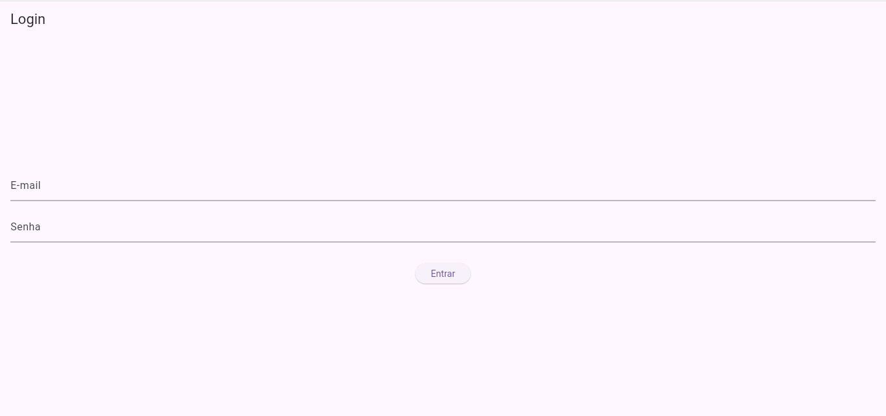
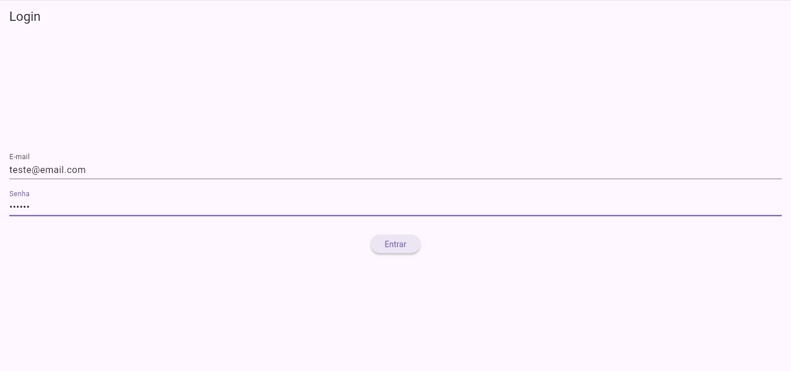
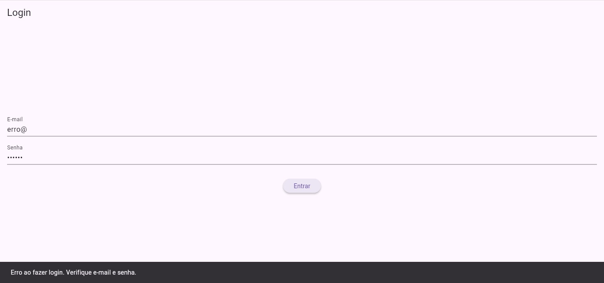
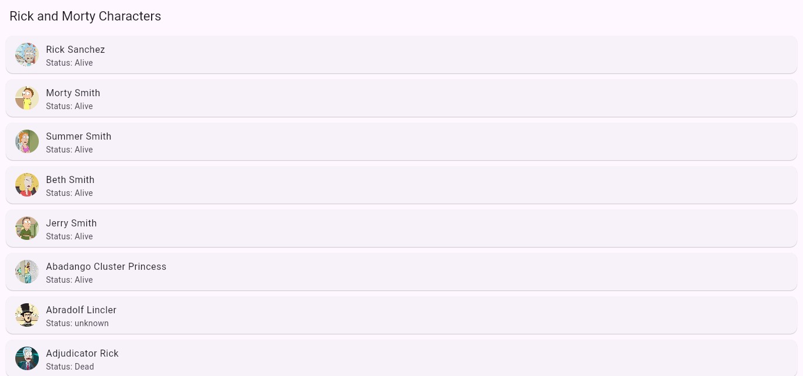
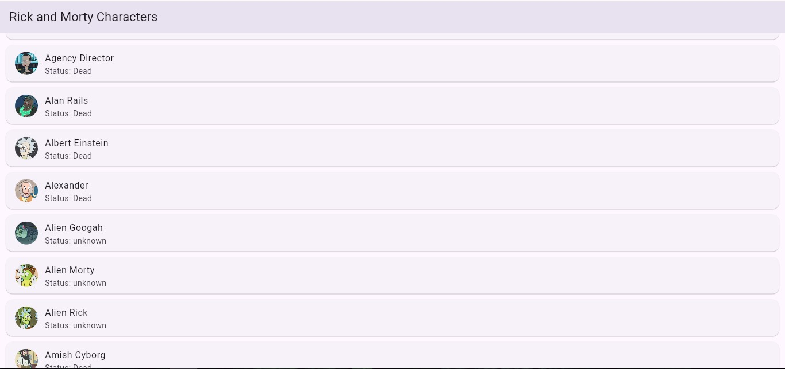

# Rick And Morty APP

Aplicativo Flutter que consome a [Rick and Morty API](https://rickandmortyapi.com/) e utiliza Firebase Authentication para login de usuários com e-mail e senha.

Este projeto foi desenvolvido como trabalho prático para a disciplina de Desenvolvimento Mobile.

**<p align=center><a href="https://rickandmorty-b4e13.web.app/">Teste a versão Web clicando aqui!</a></p>**

## 📚 Introdução ao App

Ao iniciar o aplicativo, o usuário é direcionado para a tela de Login, onde deve informar um e-mail e senha para acessar o conteúdo.

**E-mail**: teste@email.com

**Senha**: 123456

Após o login bem-sucedido, o usuário será redirecionado para a tela principal, onde é exibida uma lista de personagens da série Rick and Morty, contendo:

- Nome do personagem

- Foto do personagem

- Status de vida (Vivo ou Morto)

## 🚀 Tecnologias utilizadas

- Flutter
- Dart
- Firebase Authentication
- Firebase Hosting
- HTTP (para consumo de API)


## 📷 Prints da aplicação

**Tela de Login:**


<br/><br/>

<br/><br/>

**Login com dados não cadastrados ou incorretos:**


<br/><br/>

**Tela de Lista de Personagens:**


<br/><br/>

<br/><br/>

## ⚙️ Como executar o projeto localmente

### Pré-requisitos
- Ter o [Flutter](https://flutter.dev/docs/get-started/install) instalado na máquina.
- Ter uma conta no [Firebase](https://firebase.google.com/).

### Instalação

Clone o repositório:

```bash
git clone https://github.com/guilhermesandrade/RickAndMorty

cd RickAndMorty
```
Instale as dependências:
```bash
flutter pub get
```
Execute o projeto:
```bash
flutter run
```
Para gerar o build para Web:

```bash
flutter build web
```
Hospedando com Firebase Hosting:

Instale o Firebase CLI:
```bash
npm install -g firebase-tools
```
Faça login na sua conta do Firebase:
```bash
firebase login
```
Inicialize o Firebase Hosting no projeto:
```bash
firebase init hosting
```
Escolha seu projeto Firebase existente.

- Defina build/web como pasta pública.

- Confirme que é uma Single Page Application (responda "Yes").

- Não sobrescreva o index.html.

Realize o deploy do seu app:
```bash
firebase deploy
```

Após o deploy, será gerado um link para acessar sua aplicação hospedada na Web!

## 🌐 Link para testar a aplicação Web
👉 <a href="https://rickandmorty-b4e13.web.app/">Clique aqui para acessar o app online</a>

## 🔰 Código Fonte:

- Disponiveis na pasta 'lib', e a pasta 'pages' dentro da pasta 'lib'.
- Arquivos que procura: | main.dart | character_list_screen.dart | login_page.dart |